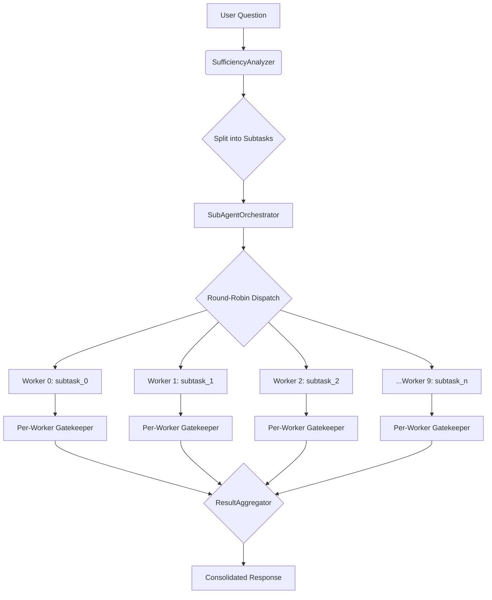

# Multi-Round Query Sufficiency Enforcement System

**Version:** 2.0  
**Status:** Implementation-Ready  
**Date:** 2026-04-15  
**Author:** Code-Graph-RAG Architecture Team

## 1. Executive Summary

This specification addresses the critical risk of **Premature LLM Response**. Currently, the RAG agent relies on soft prompts to encourage multi-round investigation. This spec introduces a **Sufficiency Gatekeeper** that programmatically evaluates whether the LLM has gathered sufficient evidence from Memgraph (Graph + Vector) and disk files before allowing it to generate a final answer.

In parallel execution mode, the Sufficiency Gatekeeper integrates with the `SubAgentOrchestrator` and its `SubAgentWorker` pool (worker count governed by `DynamicConcurrencyController`, default 10, env `CGR_DEFAULT_PARALLEL_WORKERS`) to ensure each subtask independently meets its investigation requirements before results are consolidated.

## 2. Problem Analysis

### 2.1 Current Weaknesses
1.  **No Enforcement Logic:** `main.py:_run_agent_response_loop` breaks immediately upon receiving text output, ignoring whether sufficient tools were used.
2.  **Prompt Dependency:** Instructions like "ALWAYS read actual files" are treated as suggestions by the LLM under token pressure.
3.  **No Cross-Source Validation:** The system does not verify that findings from the graph match the actual code on disk.
4.  **Parallel Subtasks Lack Per-Task Enforcement:** The `SubAgentOrchestrator` distributes work to round-robin workers but does not validate that each worker gathered sufficient evidence before returning results.

### 2.2 Requirements
*   **Mandatory Rounds:** Enforce a minimum of 2-3 rounds of querying based on question complexity.
*   **Source Diversity:** Force the use of **Vector Search**, **Graph Query**, and **File Read** for functional/implementation questions.
*   **Feedback Loop:** If the LLM tries to answer early, the system must reject the response and instruct the LLM to continue investigating.
*   **Parallel Worker Integration:** In round-robin parallel mode, each of the 10 workers independently tracks and validates sufficiency for its assigned subtask before returning results to the aggregator.
*   **Graceful Degradation:** When a required tool is unavailable (e.g., missing embeddings for `semantic_search`), the gatekeeper must adapt requirements rather than block indefinitely.
*   **Max Rejection Limit:** Prevent infinite denial loops by capping the number of rejections (default: 3).

## 3. System Architecture

### 3.1 Core Components

| Component | Location | Responsibility |
|-----------|----------|----------------|
| **SufficiencyAnalyzer** | `orchestrator/sufficiency_analyzer.py` | Classifies question type and defines minimum requirements (e.g., "Must read file"). |
| **InvestigationTracker** | `orchestrator/investigation_tracker.py` | Tracks tool usage across rounds (e.g., `used_semantic_search=True`). State is maintained in-memory (not in message history) to survive context compression. |
| **SufficiencyGatekeeper** | `orchestrator/sufficiency_gatekeeper.py` | Evaluates the final response against requirements. Returns `(Allow, Reason)` or `(Deny, Feedback)`. Supports max-rejection limits and graceful degradation. |
| **ParallelWorkerGatekeeper** | `orchestrator/sufficiency_gatekeeper.py` | Per-subtask sufficiency validator for round-robin parallel workers. Each of the 10 workers independently validates its subtask before returning results to the `ResultAggregator`. |
| **Enhanced Agent Loop** | `main.py` | Modified loop that consults the Gatekeeper before displaying output. Respects YOLO mode bypass. |

### 3.2 Data Flow — Sequential Mode

```mermaid
graph TD
    A[User Question] --> B(SufficiencyAnalyzer)
    B --> C{Define Requirements}
    C --> D[Agent Loop: Round 1]
    D --> E[Agent Loop: Round 2...]
    E --> F{LLM Generates Text Response?}
    F -- Yes --> G(SufficiencyGatekeeper)
    G --> H{Requirements Met?}
    H -- No --> I[Inject Feedback: "You missed X. Go back."]
    I --> D
    H -- Yes --> J[Display Response]
```

### 3.3 Data Flow — Parallel Round-Robin Mode (10 Workers)



In parallel mode:
1. Each subtask gets its own `InvestigationState` and `InvestigationRequirements`.
2. Workers in the `SubAgentOrchestrator` pool (default 10, scaled by `DynamicConcurrencyController`) execute subtasks independently.
3. The `ParallelWorkerGatekeeper` validates each worker's tool usage before its result is admitted to the `ResultAggregator`.
4. Results from workers that fail sufficiency are flagged in the consolidated output with a warning, but do not block the overall response (to avoid one stalled worker blocking all others).

## 4. Implementation Details

### 4.1 1. Question Classification & Requirements
**File:** `codebase_rag/orchestrator/sufficiency_analyzer.py`

Defines what constitutes "sufficient" for different question types. The keyword set is broadened to cover more patterns, and a `DIAGNOSTIC` type is added for troubleshooting questions. For production use, this can optionally integrate with the existing `ConcurrencyEligibilityClassifier` for LLM-based classification.

```python
from dataclasses import dataclass
from enum import Enum

class QuestionType(Enum):
    STRUCTURAL = "structural"   # "What classes exist?" → Graph is enough.
    FUNCTIONAL = "functional"   # "How does X work?" → Must read files.
    DIAGNOSTIC = "diagnostic"   # "Why is X failing?" → Comprehensive: all sources + cross-validation.

@dataclass
class InvestigationRequirements:
    question_type: QuestionType
    requires_vector: bool
    requires_graph: bool
    requires_file_read: bool
    min_rounds: int
    requires_cross_validation: bool = False  # Only for DIAGNOSTIC

# Expanded keyword sets for more robust classification
_FUNCTIONAL_KEYWORDS = frozenset({
    "how does", "how do", "implementation", "logic", "algorithm",
    "work", "flow", "behavior", "what happens when", "step by step",
    "describe", "explain", "process", "mechanism",
})
_STRUCTURAL_KEYWORDS = frozenset({
    "what classes", "what functions", "list all", "show me",
    "find all", "how many", "count", "directory", "structure",
    "hierarchy", "dependencies", "relationships",
})
_DIAGNOSTIC_KEYWORDS = frozenset({
    "why is", "why does", "what is wrong", "debug", "failing",
    "error", "issue", "problem", "not working", "broken",
    "stack trace", "exception", "crash",
})

def analyze_requirements(question: str) -> InvestigationRequirements:
    q_lower = question.lower()

    if any(kw in q_lower for kw in _DIAGNOSTIC_KEYWORDS):
        return InvestigationRequirements(
            QuestionType.DIAGNOSTIC,
            requires_vector=True, requires_graph=True,
            requires_file_read=True, min_rounds=3,
            requires_cross_validation=True,
        )
    if any(kw in q_lower for kw in _FUNCTIONAL_KEYWORDS):
        return InvestigationRequirements(
            QuestionType.FUNCTIONAL,
            requires_vector=True, requires_graph=True,
            requires_file_read=True, min_rounds=3,
        )
    # Default to structural investigation
    return InvestigationRequirements(
        QuestionType.STRUCTURAL,
        requires_vector=True, requires_graph=True,
        requires_file_read=False, min_rounds=2,
    )
```

### 4.2 2. Investigation Tracker
**File:** `codebase_rag/orchestrator/investigation_tracker.py`

Tracks state across the tool-use loop. State is maintained as a plain Python dataclass (outside the message history) so it survives context compression.

```python
from dataclasses import dataclass, field
from loguru import logger

# All tool names that constitute "reading a file" per the actual tool registry
# (from tool_descriptions.py: AgenticToolName.READ_FILE, GET_CODE_SNIPPET, GET_FUNCTION_SOURCE)
FILE_READ_TOOLS = frozenset({"read_file", "get_code_snippet", "get_function_source"})

@dataclass
class InvestigationState:
    rounds_completed: int = 0
    tools_used: set[str] = field(default_factory=set)
    files_read: list[str] = field(default_factory=list)
    graph_queries_run: int = 0
    tool_failures: set[str] = field(default_factory=set)  # Tools that failed with empty results

    def record_tool(self, tool_name: str, query_arg: str = "", results_count: int = 0):
        """Record a tool invocation.

        Args:
            tool_name: Actual tool name from the registry (e.g. "read_file").
            query_arg: The primary query argument (file_path, query, node_id, etc.).
            results_count: Number of results returned (0 indicates tool failure or empty result).
        """
        self.tools_used.add(tool_name)

        if tool_name == "query_graph":
            self.graph_queries_run += 1

        if tool_name in FILE_READ_TOOLS:
            if query_arg:
                self.files_read.append(query_arg)

        # Track tool failures for graceful degradation
        if results_count == 0 and tool_name in {"semantic_search", "query_graph"}:
            self.tool_failures.add(tool_name)
            logger.debug(f"Tool {tool_name} returned empty results — will be excluded from sufficiency checks")

    @classmethod
    def from_parallel_worker(cls, worker_id: int) -> "InvestigationState":
        """Create a per-worker investigation state for parallel round-robin execution.

        Args:
            worker_id: The stable integer index of the worker (0-based), NOT id(self).
                       Using id(self) (a memory address) is non-deterministic and must
                       be avoided. Pass the explicit index from SubAgentWorker.worker_id.
        """
        state = cls()
        return state
```

### 4.3 3. The Sufficiency Gatekeeper
**File:** `codebase_rag/orchestrator/sufficiency_gatekeeper.py`

The core logic that validates the LLM's attempt to finish. Supports max-rejection limits and graceful degradation when tools are unavailable.

```python
from .sufficiency_analyzer import InvestigationRequirements
from .investigation_tracker import InvestigationState

MAX_REJECTION_LIMIT = 3  # Prevent infinite denial loops

def evaluate_sufficiency(
    state: InvestigationState,
    reqs: InvestigationRequirements,
    rejection_count: int = 0,
) -> tuple[bool, str | None]:
    """Returns (is_sufficient, feedback_if_not).

    Args:
        state: Current investigation state tracking tool usage.
        reqs: Requirements for this question type.
        rejection_count: How many times the LLM has already been rejected.

    Returns:
        (True, None) if sufficient, or (False, feedback_message) if denied.
        If rejection_count >= MAX_REJECTION_LIMIT, forces acceptance to avoid infinite loops.
    """
    # 0. Max rejection safety valve
    if rejection_count >= MAX_REJECTION_LIMIT:
        return True, None  # Force accept after max rejections to prevent infinite loops

    # 1. Check Minimum Rounds
    if state.rounds_completed < reqs.min_rounds:
        return False, (
            f"Investigation too shallow. You need at least {reqs.min_rounds} rounds of querying "
            f"(currently at round {state.rounds_completed})."
        )

    # 2. Check Vector Usage (with graceful degradation)
    if reqs.requires_vector:
        if "semantic_search" in state.tool_failures:
            # Tool is unavailable — degrade gracefully, skip this requirement
            pass
        elif "semantic_search" not in state.tools_used:
            return False, (
                "CRITICAL: You must use `semantic_search` first to find relevant candidates by intent. "
                "This is the recommended entry point for functional and structural queries."
            )

    # 3. Check Graph Usage (with graceful degradation)
    if reqs.requires_graph:
        if "query_graph" in state.tool_failures:
            pass
        elif "query_graph" not in state.tools_used:
            return False, (
                "CRITICAL: You must use `query_graph` to understand structural relationships "
                "between code elements."
            )

    # 4. Check File Usage (with graceful degradation)
    if reqs.requires_file_read:
        file_tools_available = not (
            "read_file" in state.tool_failures
            and "get_code_snippet" in state.tool_failures
            and "get_function_source" in state.tool_failures
        )
        if file_tools_available and not state.files_read:
            return False, (
                "CRITICAL: You MUST read the actual source files using `read_file`, "
                "`get_code_snippet`, or `get_function_source`. Graph data alone is insufficient "
                "for implementation-level questions."
            )

    # 5. Cross-validation (DIAGNOSTIC only)
    # Note: True programmatic cross-validation (verifying graph findings against file content)
    # is an LLM-level concern and cannot be enforced programmatically. When
    # requires_cross_validation=True, the system prompt instructs the LLM to explicitly
    # compare its graph-derived findings against actual source files. The proxy check
    # here is that both graph queries AND file reads were performed, which is already
    # covered by checks 3 and 4 above.

    return True, None


def evaluate_parallel_worker_sufficiency(
    state: InvestigationState,
    reqs: InvestigationRequirements,
    worker_id: int,
) -> tuple[bool, str | None]:
    """Evaluate sufficiency for a parallel round-robin worker's subtask.

    Unlike the sequential gatekeeper, parallel mode does NOT enforce minimum rounds
    (each subtask is self-contained) and does NOT block on rejection (to avoid
    one stalled worker blocking the entire aggregation).

    Returns:
        (True, None) if sufficient, or (False, warning_message) if insufficient.
        Warnings are included in the consolidated output but do not block the response.
    """
    warnings: list[str] = []

    # Check file usage for functional subtasks
    if reqs.requires_file_read and not state.files_read:
        warnings.append(
            f"[Worker {worker_id}] Subtask requires file-level evidence but no files were read."
        )

    # Check graph usage
    if reqs.requires_graph and "query_graph" not in state.tools_used:
        if "query_graph" not in state.tool_failures:
            warnings.append(
                f"[Worker {worker_id}] Subtask did not query the code graph for structural context."
            )

    if warnings:
        return False, " | ".join(warnings)

    return True, None
```

### 4.4 4. Modified Agent Loop Integration
**File:** `codebase_rag/main.py` (Method: `_run_agent_response_loop`)

This is the most critical change. We inject a check *after* the LLM tries to speak. The implementation:

- Extracts the actual query argument from each tool call's `args_as_dict()` (matching the existing `_process_tool_approvals` pattern at line 350 of main.py).
- Maintains a `rejection_count` to prevent infinite denial loops.
- Bypasses sufficiency enforcement in YOLO mode.
- Preserves the `InvestigationState` outside the message history (survives context compression).
- Records tool usage immediately when calls are dispatched (not after execution, since results come back in the next round's message history).

```python
from pydantic_ai.messages import ModelRequest, UserPromptPart

# Actual tool names from tool_descriptions.py AgenticToolName enum
FILE_READ_TOOL_NAMES = {"read_file", "get_code_snippet", "get_function_source"}

def _extract_tool_query_arg(tool_name: str, args: dict) -> str:
    """Extract the primary query argument from a tool call's arguments dict.

    Matches the actual parameter names used in each tool's function signature:
    - query_graph: natural_language_query (per tool_descriptions.py + cypher_queries.py)
    - semantic_search: query (per semantic_search.py: semantic_search_functions)
    - read_file: file_path (per file_reader.py: read_file_content)
    - get_code_snippet: qualified_name (per code_retrieval.py: get_code_snippet)
    - get_function_source: node_id (per semantic_search.py: get_function_source_by_id)
    """
    if tool_name == "query_graph":
        return str(args.get("natural_language_query", ""))
    if tool_name == "semantic_search":
        return str(args.get("query", ""))
    if tool_name == "read_file":
        return str(args.get("file_path", ""))
    if tool_name == "get_code_snippet":
        return str(args.get("qualified_name", ""))
    if tool_name == "get_function_source":
        return str(args.get("node_id", ""))
    return str(args.get("query", args.get("command", "")))


async def _run_agent_response_loop(
    rag_agent: Agent[None, str | DeferredToolRequests],
    message_history: list[ModelMessage],
    question_with_context: str,
    config: AgentLoopUI,
    tool_names: ConfirmationToolNames,
    model_override: Model | None = None,
    model_override_config: ModelConfig | None = None,
) -> None:
    # Import sufficiency components
    from .orchestrator.sufficiency_analyzer import analyze_requirements
    from .orchestrator.investigation_tracker import InvestigationState
    from .orchestrator.sufficiency_gatekeeper import evaluate_sufficiency

    requirements = analyze_requirements(question_with_context)
    state = InvestigationState()
    rejection_count = 0

    deferred_results: DeferredToolResults | None = None

    while True:
        # === AUTOMATIC CONTEXT COMPRESSION HOOK ===
        # (Existing compression logic remains unchanged. state survives compression
        #  because it is a local Python object, not stored in message_history.)
        if (
            settings.CONTEXT_COMPRESSION_ENABLED
            and message_history
            and not deferred_results
        ):
            # ... [existing compression code, unchanged] ...
            pass

        with app_context.console.status(config.status_message):
            response = await run_with_cancellation(
                rag_agent.run(
                    question_with_context,
                    message_history=message_history,
                    deferred_tool_results=deferred_results,
                    model=model_override,
                ),
            )

        if isinstance(response, CancelledResult):
            log_session_event(config.cancelled_log)
            app_context.session.cancelled = True
            break

        if isinstance(response.output, DeferredToolRequests):
            # --- Tool Call Processing ---
            # Record tool usage BEFORE approval (matching existing pattern at main.py:350)
            for call in response.output.approvals:
                args = call.args_as_dict()
                query_arg = _extract_tool_query_arg(call.tool_name, args)
                state.record_tool(call.tool_name, query_arg)

            # Count each tool-use round toward the minimum-rounds requirement.
            state.rounds_completed += 1

            deferred_results = _process_tool_approvals(
                response.output,
                config.approval_prompt,
                config.denial_default,
                tool_names,
            )
            new_msgs = response.new_messages()
            message_history.extend(new_msgs)
            _update_state_from_tool_returns(new_msgs, state)
            continue

        # --- LLM Generated Text Response ---
        output_text = response.output
        if not isinstance(output_text, str):
            continue

        # === NEW: Sufficiency Gate ===
        # YOLO MODE bypass: skip enforcement when auto-approve is on
        if not app_context.session.yolo_mode:
            is_sufficient, feedback = evaluate_sufficiency(state, requirements, rejection_count)

            if not is_sufficient:
                # DENY RESPONSE: Force LLM to continue investigating
                rejection_count += 1
                if rejection_count >= 3:
                    # Max rejections reached — force accept with a warning
                    app_context.console.print(
                        Panel(
                            "⚠️ Max rejections reached (3). Accepting response with incomplete investigation.",
                            border_style="yellow",
                        )
                    )
                else:
                    feedback_msg = (
                        f"\n**SYSTEM CORRECTION (attempt {rejection_count}/3):** {feedback}\n\n"
                        f"You are not allowed to answer yet. Please use the required tools "
                        f"to gather more information before generating a final response."
                    )
                    message_history.extend(response.new_messages())
                    message_history.append(ModelRequest(parts=[UserPromptPart(feedback_msg)]))

                    app_context.console.print(
                        Panel(f"⚠️ Investigation Incomplete: {feedback}", border_style="yellow")
                    )
                    continue  # Loop again, forcing LLM to use tools

        # ALLOW RESPONSE (either sufficient, YOLO mode, or max rejections reached)
        markdown_response = Markdown(output_text)
        app_context.console.print(
            Panel(
                markdown_response,
                title=config.panel_title,
                border_style=cs.Color.GREEN,
            )
        )

        log_session_event(f"{cs.SESSION_PREFIX_ASSISTANT}{output_text}")
        message_history.extend(response.new_messages())
        break
```

**Key differences from the original spec:**
1. Tool usage is recorded from `response.output.approvals` (the actual attribute used in the existing codebase at `main.py:350`), not from a non-existent `.tool_calls` attribute.
2. Tool failures are detected by inspecting `ToolReturnPart` content in the messages returned by the *next* `agent.run()` call. A helper `_update_state_from_tool_returns` (below) scans those messages immediately after `message_history.extend(response.new_messages())` in the `DeferredToolRequests` branch.
3. The `record_tool` call does **not** pass `results_count` at dispatch time — failure detection is deferred to the next round via the helper.

```python
def _update_state_from_tool_returns(
    new_messages: list[ModelMessage],
    state: InvestigationState,
) -> None:
    """Scan tool return messages for empty/failed results and populate state.tool_failures.

    Called after message_history.extend(response.new_messages()) in the
    DeferredToolRequests branch so failures are visible before the next sufficiency check.
    pydantic_ai surfaces tool results as ToolReturnPart objects inside ModelRequest messages.
    """
    from pydantic_ai.messages import ModelRequest, ToolReturnPart

    for msg in new_messages:
        if not isinstance(msg, ModelRequest):
            continue
        for part in msg.parts:
            if not isinstance(part, ToolReturnPart):
                continue
            content = str(part.content) if part.content is not None else ""
            if not content or "no results" in content.lower() or "not found" in content.lower():
                state.tool_failures.add(part.tool_name)
```

Wire this into the `DeferredToolRequests` branch **after** the `message_history.extend` call:

```python
            new_msgs = response.new_messages()
            message_history.extend(new_msgs)
            _update_state_from_tool_returns(new_msgs, state)
            continue
```

### 4.5 5. Parallel Round-Robin Worker Integration
**File:** `codebase_rag/orchestrator/subagent_orchestrator.py`

Integration with the existing `SubAgentOrchestrator` and its round-robin worker pool. Each `ReadOnlySubAgent` gets its own `InvestigationState` and `SufficiencyGatekeeper`.

> **Breaking change:** `ReadOnlySubAgent.execute()` currently returns `str`. This integration changes it to return a `SubtaskResult` TypedDict. The `ResultAggregator.add_result()` accepts `Any` for `result`, so no aggregator changes are needed — but any caller that previously used the return value as a plain string must be updated to access `result["content"]`.

```python
from typing import TypedDict

class SufficiencyMetadata(TypedDict):
    passed: bool
    warning: str | None
    tools_used: list[str]
    files_read: list[str]

class SubtaskResult(TypedDict):
    content: str
    sufficiency: SufficiencyMetadata
```

```python
# In subagent_orchestrator.py — modify ReadOnlySubAgent.execute()

from .investigation_tracker import InvestigationState
from .sufficiency_analyzer import analyze_requirements
from .sufficiency_gatekeeper import evaluate_parallel_worker_sufficiency

class ReadOnlySubAgent:
    # ... existing code ...

    def execute(self, subtask: dict[str, str | int]) -> SubtaskResult:
        """Execute a subtask with sufficiency enforcement."""
        self._initialize()
        if self.agent is None:
            raise RuntimeError("Parallel sub-agent was not initialized")

        # Use the stable integer index stored on ReadOnlySubAgent (add self._worker_index
        # as a constructor parameter). Never use id(self) — it is a memory address and
        # is non-deterministic across GC cycles.
        worker_index: int = getattr(self, "_worker_index", 0)

        # Create per-subtask investigation state
        subtask_reqs = analyze_requirements(subtask.get("prompt", ""))
        state = InvestigationState.from_parallel_worker(worker_id=worker_index)

        # Wrap agent.run to intercept tool calls
        response = asyncio.run(
            self.agent.run(subtask.get("prompt", ""), message_history=[])
        )

        # Analyze response for tool usage
        if hasattr(response, "new_messages"):
            for msg in response.new_messages():
                for part in getattr(msg, "parts", []):
                    if hasattr(part, "tool_name"):
                        state.record_tool(part.tool_name, "")

        # Evaluate sufficiency (non-blocking in parallel mode)
        is_sufficient, warning = evaluate_parallel_worker_sufficiency(
            state, subtask_reqs, worker_id=worker_index
        )

        output = response.output if isinstance(response.output, str) else str(response.output)

        return SubtaskResult(
            content=output,
            sufficiency=SufficiencyMetadata(
                passed=is_sufficient,
                warning=warning,
                tools_used=list(state.tools_used),
                files_read=state.files_read,
            ),
        )
```

The `ResultAggregator` then includes sufficiency metadata in its consolidated output:
```python
# In result_aggregator.consolidate()
for result in self.results:
    sufficiency = result.get("sufficiency", {})
    if not sufficiency.get("passed"):
        consolidated_warnings.append(sufficiency.get("warning", ""))
# Warnings are appended to the final output as a footer section.
```

## 5. Enhanced System Prompt
Update `codebase_rag/prompts.py` by appending the sufficiency protocol to `build_rag_orchestrator_prompt()`. The prompt uses the **actual tool names** from the `AgenticToolName` enum (`tool_descriptions.py`) and informs the LLM about the rejection limit.

```python
# Add to prompts.py — insert at the end of build_rag_orchestrator_prompt()

MULTI_ROUND_PROTOCOL = """
**MANDATORY INVESTIGATION PROTOCOL:**
1.  You are monitored by a **Sufficiency Gatekeeper** that programmatically validates your work.
2.  You CANNOT respond with a final answer until you have completed the required investigation:
    - Use `semantic_search` first to find relevant candidates by intent/purpose.
    - Use `query_graph` to explore structural relationships between code elements.
    - Use `read_file`, `get_code_snippet`, or `get_function_source` to verify actual implementation details (required for functional/diagnostic questions).
3.  If you try to answer before completing these steps, the system will **reject your response** and inject a correction message forcing you to continue investigating.
4.  You have a maximum of 3 rejection attempts. After that, your answer will be accepted but flagged as incomplete.
5.  If a tool returns no results or fails, you may skip it — the gatekeeper detects failures and adapts its requirements accordingly.
"""
```

Integration point in `prompts.py`:
```python
def build_rag_orchestrator_prompt(tools: list["Tool"]) -> str:
    # ... existing prompt construction ...
    return f"""{existing_prompt}

{MULTI_ROUND_PROTOCOL}
"""
```

This ensures the LLM is aware of the enforcement mechanism before it begins investigation, reducing wasted rounds on premature answer attempts.

## 6. Testing Strategy

Tests should be placed in `codebase_rag/tests/test_sufficiency_enforcement.py`.

### 6.1 Unit Tests — Gatekeeper Logic

| # | Test | Setup | Expected |
|---|------|-------|----------|
| 1 | `test_gatekeeper_insufficient_file_read` | State: `tools_used={"query_graph", "semantic_search"}`, `files_read=[]`. Requirements: `requires_file_read=True`. | `(False, "CRITICAL: You MUST read the actual source files...")` |
| 2 | `test_gatekeeper_insufficient_rounds` | State: `rounds_completed=1`, `tools_used={...}`, `files_read=["main.py"]`. Requirements: `min_rounds=3`. | `(False, "Investigation too shallow... at least 3 rounds...")` |
| 3 | `test_gatekeeper_sufficient_functional` | State: `rounds_completed=3`, `tools_used={"semantic_search","query_graph","read_file"}`, `files_read=["main.py"]`. Requirements: `requires_file_read=True, min_rounds=3`. | `(True, None)` |
| 4 | `test_gatekeeper_max_rejection_override` | Same as #1, but `rejection_count=3`. | `(True, None)` — force-accept to avoid infinite loop |
| 5 | `test_gatekeeper_graceful_degradation` | State: `tools_used={"read_file"}`, `files_read=["main.py"]`, `tool_failures={"semantic_search","query_graph"}`. Requirements: `requires_vector=True, requires_graph=True, requires_file_read=True`. | `(True, None)` — failed tools are excluded from requirements |
| 6 | `test_gatekeeper_all_file_tools_failed` | State: `tool_failures={"read_file","get_code_snippet","get_function_source"}`, `files_read=[]`. Requirements: `requires_file_read=True`. | `(True, None)` — all file tools failed, cannot enforce |

### 6.2 Unit Tests — Analyzer Classification

| # | Test | Input Question | Expected Type |
|---|------|---------------|---------------|
| 7 | `test_analyze_diagnostic` | "Why is the authentication failing with a 401 error?" | `DIAGNOSTIC`, `requires_cross_validation=True` |
| 8 | `test_analyze_functional` | "How does the context compression mechanism work?" | `FUNCTIONAL`, `requires_file_read=True, min_rounds=3` |
| 9 | `test_analyze_structural` | "List all classes in the services module" | `STRUCTURAL`, `requires_file_read=False, min_rounds=2` |

### 6.3 Unit Tests — Investigation Tracker

| # | Test | Scenario | Expected |
|---|------|----------|----------|
| 10 | `test_tracker_records_all_file_tools` | Record `read_file`, `get_code_snippet`, `get_function_source` separately. | `files_read` contains all three entries, `tools_used` has all three |
| 11 | `test_tracker_detects_tool_failure_via_record_tool` | Call `state.record_tool("semantic_search", results_count=0)` directly (as the parallel worker path may do). | `tool_failures` contains `"semantic_search"`. Note: the sequential agent loop instead calls `_update_state_from_tool_returns` — test that separately (see §6.4, Test #13). |
| 12 | `test_tracker_parallel_worker_state` | `InvestigationState.from_parallel_worker(worker_id=5)` | Returns fresh state instance (isolated per worker) |

### 6.4 Integration Tests

| # | Test | Scenario | Assert |
|---|------|----------|--------|
| 13 | `test_loop_rejects_premature_answer` | Mock LLM returns text after round 1. Requirements: `min_rounds=3`. | Loop does **not** break; feedback message is injected into `message_history` |
| 14 | `test_loop_allows_sufficient_answer` | Mock LLM returns text after round 3 with all tools used. | Loop breaks; response is displayed |
| 15 | `test_loop_yolo_mode_bypass` | YOLO mode enabled. LLM returns text after round 1 with no tools. | Loop breaks immediately — sufficiency check is skipped |
| 16 | `test_loop_max_rejection_force_accept` | LLM answers prematurely 3 times in a row. | On the **3rd** premature answer `rejection_count` reaches 3, the loop falls through to ALLOW RESPONSE and displays it with a yellow warning panel (no 4th attempt needed) |
| 17 | `test_loop_survives_context_compression` | Trigger compression mid-investigation (mock `count_tokens` to exceed threshold). | `InvestigationState` retains all recorded tool usage after compression |

### 6.5 Parallel Worker Integration Tests

| # | Test | Scenario | Assert |
|---|------|----------|--------|
| 18 | `test_parallel_worker_sufficiency_pass` | Worker reads files and queries graph for its subtask. | `evaluate_parallel_worker_sufficiency` returns `(True, None)` |
| 19 | `test_parallel_worker_sufficiency_warning` | Worker returns text without reading files (functional subtask). | Returns `(False, "[Worker N] Subtask requires file-level evidence...")` |
| 20 | `test_round_robin_distribution_with_sufficiency` | 10 subtasks dispatched to 10 workers via round-robin. | Each worker gets exactly 1 subtask; sufficiency metadata is present in all consolidated results |
| 21 | `test_result_aggregator_includes_sufficiency_warnings` | 3 of 10 workers fail sufficiency. | Consolidated output contains a "Sufficiency Warnings" footer listing all 3 warnings |
